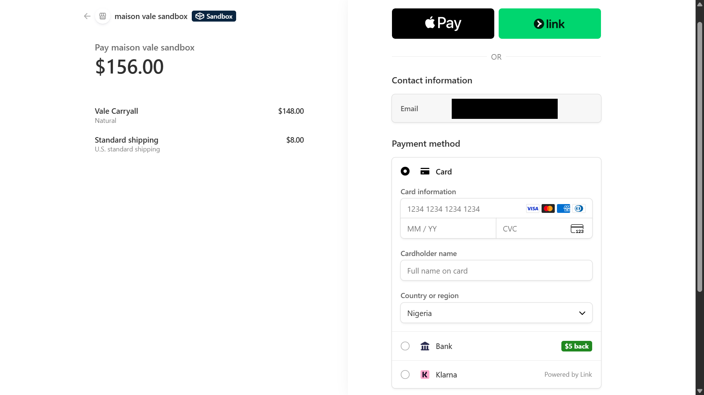
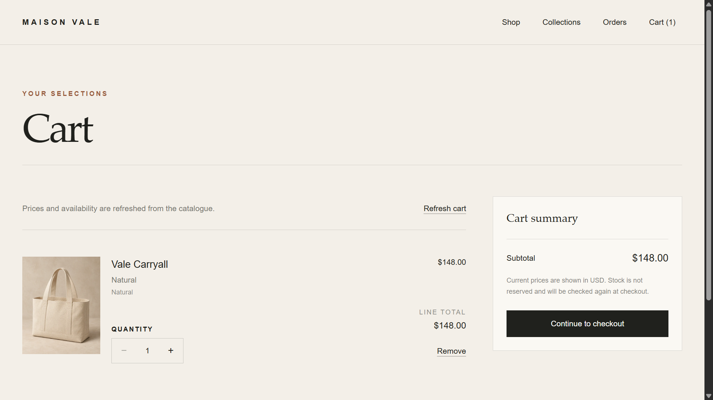
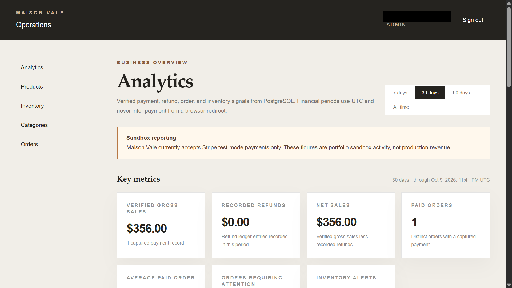
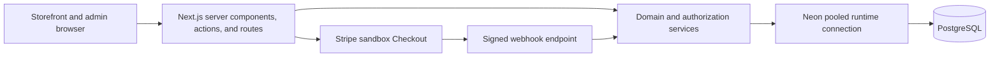

# Maison Vale

Maison Vale is a fictional premium fashion and lifestyle commerce application built as a full-stack engineering portfolio project. It pairs an editorial storefront with conservative payment, inventory, guest-order, administration, and deployment workflows.

**Live sandbox:** [maison-vale-six.vercel.app](https://maison-vale-six.vercel.app)

The deployment uses Stripe test mode only. It cannot accept real payments, and no commercial performance, customer, revenue, or conversion claims are implied.


## Business purpose

The project demonstrates how a polished storefront can preserve server authority when prices, stock, payment state, customer information, and staff permissions are involved. The browser provides interaction and presentation; validated server boundaries, PostgreSQL transactions, and signed webhooks establish business truth.

## Product capabilities

### Storefront

- Eight fictional products across four collections, with 24 curated product photographs and one editorial image
- Variant-aware galleries, pricing, low-stock messaging, sold-out states, and accessible add-to-bag feedback
- Versioned guest cart that persists only variant identifiers and quantities
- Server-resolved prices, visibility, stock, shipping, tax, and totals
- U.S.-only guest checkout through Stripe-hosted Checkout in test mode
- Privacy-aware order lookup using an order reference and matching checkout email
- Masked public order details and a short-lived, one-order lookup session

### Administration

- Credentials-based ADMIN and STAFF access with active-user database rechecks
- Product, variant, category, image, and inventory management
- Immutable inventory-movement history and optimistic concurrency checks
- Secure order search and audited manual fulfillment transitions
- Read-only commerce analytics derived from persisted payment, refund, order-item, and inventory records
- ADMIN-only mutations with STAFF read access where supported

### Operational safeguards

- Raw-body Stripe signature verification and durable webhook idempotency
- Atomic payment finalization, inventory decrements, movement records, and order advancement
- Truthful paid-but-unfulfillable review state when inventory cannot be committed
- HMAC-keyed database rate limits, canonical Origin checks, and byte-bounded request bodies
- Private/no-store policies for administrative, checkout, order, and API surfaces
- Guarded migration, catalogue-bootstrap, reconciliation, and administrator-provisioning scripts

## Selected interface

| Product selection | Stripe sandbox checkout |
|---|---|
|  |  |
| **Shopping bag** | **Administrative analytics** |
|  |  |

Additional reviewed captures and the privacy-aware publication register are documented in the [portfolio screenshot plan](./docs/PORTFOLIO_SCREENSHOTS.md).

## Technology

- Next.js 16 App Router, React 19, TypeScript, and Tailwind CSS
- PostgreSQL with Prisma ORM 7 and `@prisma/adapter-pg`
- Auth.js credentials sessions and bcrypt password hashing
- Stripe Checkout and signed sandbox webhooks
- Vitest, PostgreSQL integration scripts, ESLint, and TypeScript
- Vercel hosting with a TLS-protected Neon pooled runtime connection
- GitHub Actions release checks

## Architecture



Public and administrative interfaces consume allow-listed DTOs. Route handlers and Server Actions validate untrusted input before invoking domain services. PostgreSQL constraints, conditional updates, uniqueness, and transactions protect durable invariants. Runtime traffic uses `DATABASE_URL`; controlled Prisma migration commands use a separate `DIRECT_URL` that is not required by the deployed web application.

More detail is available in [`docs/ARCHITECTURE.md`](./docs/ARCHITECTURE.md), [`docs/API.md`](./docs/API.md), and [`docs/DATABASE.md`](./docs/DATABASE.md).

## Checkout, webhook, and inventory lifecycle

1. The server re-resolves the cart and calculates integer-cent totals.
2. A pending order, immutable item snapshots, and a pending payment are stored before redirecting to Stripe.
3. Stripe hosts card collection in test mode. The browser return URL is navigation only and never proves payment.
4. The webhook verifies the untouched request body and Stripe signature, then validates mode, session linkage, amount, and currency.
5. A database transaction claims the payment transition, decrements every purchased variant, records inventory movements, advances the order, and marks the webhook event processed.
6. Duplicate or concurrent delivery cannot repeat payment or inventory effects.
7. If paid inventory cannot be committed, payment remains truthfully paid while fulfillment stays pending for manual review; partial stock mutations are rolled back.

The hosted sandbox checkout reviewed for TASK-015 produced `PAID`, `PROCESSING`, `PAYMENT_FINALIZED`, one movement of `-2`, and no payment exception. These are technical verification results for fictional test data, not business metrics.

## Authentication and authorization

Auth.js issues an eight-hour JWT session containing minimal identity and role data. Every protected admin request rechecks the current database user and rejects missing or inactive accounts. ADMIN and STAFF can access approved read surfaces; catalogue, inventory, and fulfillment mutations independently require ADMIN authority on the server.

Guest order lookup is separate from administrator authentication. A valid reference and matching checkout email create a signed 15-minute HttpOnly cookie scoped to `/orders`. Public responses omit the email, street address, SKU, internal identifiers, provider identifiers, issue metadata, and internal notes. This is lightweight guest verification, not strong ownership authentication.

## Security and testing

The project applies server-authoritative totals and stock, Zod validation, constant-time proof comparison where applicable, source and proof-pair rate limits, same-origin mutation checks, conservative logging, encrypted hosted database transport, response security headers, and explicit noindex/cache boundaries.

Automated coverage includes:

- Authentication, role policy, password handling, and rate limiting
- Catalogue visibility, variant stock states, carts, and authoritative checkout totals
- Inventory concurrency, transactional movements, and rollback
- Stripe signature checks, payment idempotency, mismatches, and inventory exceptions
- Guest lookup isolation, expiry, status mapping, masking, and enumeration resistance
- Administrative catalogue, order, analytics, and fulfillment rules
- Production configuration, Neon connection policy, metadata routes, and hosted admin response handling

The verification commands are documented in [`docs/TESTING.md`](./docs/TESTING.md). Security decisions and residual risks are documented in [`docs/SECURITY.md`](./docs/SECURITY.md) and [`docs/SECURITY_AUDIT.md`](./docs/SECURITY_AUDIT.md).

## Demonstrated hosted QA

The public deployment and read-only QA were verified on 9 October 2026. The automated hosted check confirmed:

- Homepage, shop, four collection routes, and eight product routes returned successfully
- All 25 reviewed images passed the hosted Next.js optimizer
- CSP, framing, MIME-sniffing, HSTS, and framework-disclosure policies were present as expected
- Cart, checkout, orders, admin, and API indexing/cache boundaries were enforced
- Unauthenticated `/admin` resolved only to the same-origin login boundary, including Next.js streamed redirect behavior
- Missing-Origin order-lookup and Checkout Session requests were rejected

The owner reports completing the agreed browser checklist on 9 October 2026: desktop storefront and product navigation, mobile responsiveness, basic keyboard navigation and visible focus, browser zoom and motion preferences, the authenticated administrator workflow, and guest order lookup behavior. This owner report is separate from automated QA and the independently reviewed sandbox database/payment outcome. Hosted STAFF/inactive-user verification, production cookie inspection, advanced lookup and webhook edge cases, formal accessibility verification, runtime logs and alerting, backup restoration, and rollback remain pending. See [`docs/HOSTED_QA.md`](./docs/HOSTED_QA.md) for the evidence boundary.

## Local development

Requirements: Node.js 22, npm, Docker, and Git.

```bash
npm install
```

Copy `.env.example` to an ignored `.env`, retain the local PostgreSQL URLs, generate independent development secrets for `AUTH_SECRET`, `RATE_LIMIT_SECRET`, and `ORDER_LOOKUP_SECRET`, and leave one-off operator gates disabled.

```bash
docker compose up -d db
npm run db:generate
npm run db:migrate
npm run db:seed
npm run db:smoke
npm run dev
```

Open [http://localhost:3000](http://localhost:3000). The ordinary seed is for local development only and includes deliberate fixtures; remote databases require the separately guarded public-catalogue workflow described in [`docs/DEPLOYMENT.md`](./docs/DEPLOYMENT.md).

Core checks:

```bash
npm run lint
npm run typecheck
npm test
npm run test:auth:integration
npm run test:catalogue:integration
npm run test:inventory:integration
npm run test:cart:integration
npm run test:checkout:integration
npm run test:payment:integration
npm run test:orders:integration
npm run test:admin-catalogue:integration
npm run test:admin-orders:integration
npm run test:admin-analytics:integration
npm run deployment:assets
npm run build
git diff --check
```

For a local administrator, set `ADMIN_EMAIL` and `ADMIN_PASSWORD` only in the ignored local environment and run `npm run admin:provision`. No reusable administrator credentials are published for the hosted portfolio.

## Deployment

The hosted topology is Vercel, Neon PostgreSQL, and Stripe sandbox. Neon runtime traffic uses its TLS-protected `-pooler` endpoint with a deliberately small application pool. The direct migration credential belongs only in a controlled operator environment. Builds generate Prisma Client but do not migrate, seed, reconcile, or provision accounts.

```bash
npm run deployment:check
npm run deployment:assets
npm run qa:hosted -- --url=https://maison-vale-six.vercel.app
```

Operational prerequisites and rollback constraints are in [`docs/DEPLOYMENT.md`](./docs/DEPLOYMENT.md) and [`docs/TASK_015_CHECKLIST.md`](./docs/TASK_015_CHECKLIST.md).

## Portfolio material

- [Portfolio case study](./docs/PORTFOLIO_CASE_STUDY.md)
- [Screenshot and evidence plan](./docs/PORTFOLIO_SCREENSHOTS.md)
- [Hosted QA evidence register](./docs/HOSTED_QA.md)

## Known limitations

- Stripe sandbox only; real charges are rejected.
- U.S.-only checkout, fixed shipping rules, USD only, and recorded tax of zero.
- No automated refunds, cancellation/restock workflow, abandoned-checkout cleanup, or carrier integration.
- Shipping and delivery transitions are manual and do not create tracking data.
- No customer accounts, transactional-email verification, administrator MFA, or password recovery.
- Email-plus-reference order lookup is lightweight verification.
- Hosted STAFF/inactive-user checks, production cookie inspection, advanced lookup/webhook edge cases, formal accessibility verification, alerting, backup restoration, and rollback drills remain outstanding.
- The project has not undergone a penetration test or compliance certification.

These limitations keep the deployment suitable for portfolio sandbox demonstration, not live commerce.
