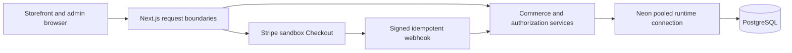

# Maison Vale

Maison Vale is a fictional premium lifestyle e-commerce portfolio application. The repository includes the project foundation, PostgreSQL/Prisma data layer, administrative authentication and operations, public catalogue, guest cart, Stripe test-mode checkout, and database-backed commerce analytics.

> **Deployment status:** hosted deployment and QA are not yet verified. No live demo URL is published in this README. Payments are simulated with Stripe sandbox; the application cannot accept real charges.

## Technology

Next.js 16, React 19, TypeScript, Tailwind CSS, PostgreSQL 17, Prisma ORM 7, Auth.js, bcrypt, Stripe Checkout, Vitest, ESLint, GitHub Actions, Vercel, and Neon.

## Current foundation

- Next.js App Router with React and TypeScript
- Tailwind CSS and Turbopack
- PostgreSQL 17 through Docker Compose on local port 5435
- Prisma ORM 7 with the PostgreSQL driver adapter and tracked migrations
- Initial catalogue, inventory, order, payment, refund, and webhook-ledger models
- Project documentation in [`docs/`](./docs)
- Auth.js credentials authentication for active ADMIN and STAFF users
- Protected `/admin` shell with server-side database rechecks and role helpers
- Database-backed, HMAC-keyed login attempt limiting
- Public storefront at `/`, `/shop`, `/shop/[slug]`, and `/collections/[slug]`
- Server-rendered catalogue queries with active and published visibility rules
- Variant-aware low-stock and sold-out messaging with accessible add-to-bag confirmation
- Honest variant pricing, advisory availability, ordered product images, and safe public DTOs
- Variant-level inventory authority with validated, concurrency-safe stock mutations
- Transactional inventory movement history for restocks, corrections, and future order activity
- Versioned browser-persisted guest cart with authoritative server-side price and availability resolution
- U.S.-only guest checkout validation with authoritative shipping, tax, and final totals
- Stripe-hosted test-mode Checkout with order-before-payment snapshots
- Raw-body signed webhooks with durable idempotency and transactional inventory finalization
- Privacy-aware guest order lookup with masked details and short-lived scoped access
- Searchable administrative product, variant, category, image, and inventory tools
- ADMIN-only catalogue mutations, STAFF read access, archival workflows, and audited stock changes
- Secure administrative order search, full fulfillment details, and audited manual dispatch/delivery
- Protected read-only analytics with verified sales, refund, order, snapshot-performance, and live inventory signals
- Variant-aware product galleries backed by 24 optimized catalogue photographs and a curated editorial image
- Responsive storefront navigation, visible keyboard focus, skip navigation, and reduced-motion support
- Production-oriented security headers, trusted-proxy handling, byte-bounded request reads, and source-wide abuse limits
- Deployment configuration validation, guarded operational scripts, rate-limit maintenance, and CI verification
- No public registration, automated refunds, or carrier tracking

## Architecture



The browser is a convenience layer, never a pricing, inventory, role, or payment authority. Server boundaries validate hostile input and return allow-listed DTOs. PostgreSQL constraints and transactions protect durable invariants. Stripe redirects provide navigation only; verified webhooks establish payment truth.

## Local development

```bash
npm install
npm run db:generate
docker compose up -d db
npm run db:migrate
npm run db:seed
npm run db:smoke
npm run dev
```

Open [http://localhost:3000](http://localhost:3000) to view the project.

Useful checks:

```bash
npm run lint
npm run typecheck
npm run test
npm run test:catalogue:integration
npm run test:inventory:integration
npm run test:cart:integration
npm run test:checkout:integration
npm run test:payment:integration
npm run test:orders:integration
npm run test:admin-catalogue:integration
npm run test:admin-orders:integration
npm run test:admin-analytics:integration
npm run deployment:check
npm run deployment:assets
npm run rate-limits:cleanup
npm run build
npm run db:status
git diff --check
```

## Local administrator provisioning

Set `ADMIN_EMAIL` and `ADMIN_PASSWORD` in the local ignored `.env` file, then run:

```bash
npm run admin:provision
```

The password must contain 12 to 128 characters. Provisioning creates a new ADMIN account or deliberately updates and activates the existing account with the normalized email. The script never prints the password.

There are no public demo administrator credentials. A hosted portfolio should present sanitized admin screenshots or a supervised demonstration instead of publishing reusable credentials.

## Deployment and hosted QA

The target is Vercel with Neon PostgreSQL and Stripe sandbox. Runtime traffic uses Neon's TLS-protected `-pooler` endpoint with a bounded application pool. Prisma migrations use the unpooled direct URL from a controlled operator environment; the direct migration credential is not configured in the Vercel web runtime.

```bash
npm run deployment:check
npm run deployment:check:migrations
npm run deployment:assets
npm run qa:hosted -- --url=https://your-verified-host.example
```

The hosted QA command is read-only. It verifies public routes, indexing boundaries, response security headers, all 25 optimized images, the unauthenticated admin access boundary, and missing-Origin rejection. The admin check accepts either a conventional same-origin HTTP redirect or Next.js's private, no-store streamed redirect to the login page; it rejects an ordinary HTTP 200 page, an external destination, and protected admin content. Stripe Checkout, authenticated administration, secure cookies, logs, accessibility, backups, and responsive presentation still require manual evidence.

Follow [`docs/TASK_015_CHECKLIST.md`](./docs/TASK_015_CHECKLIST.md) before adding a live URL. Never paste production or sandbox credentials into an issue, pull request, screenshot, or chat.

Hosted results are recorded separately in [`docs/HOSTED_QA.md`](./docs/HOSTED_QA.md); pending entries are not implied successes.

## Roadmap

The planned implementation sequence is documented in [`docs/TASKS.md`](./docs/TASKS.md). Decisions and unresolved questions are recorded in [`docs/DECISIONS.md`](./docs/DECISIONS.md).

## Engineering notes

Checkout creates a pending order and payment before redirecting to Stripe-hosted Checkout. Only a verified webhook can record payment truth and advance the order. Inventory is not reserved; it is committed transactionally after payment, with a review state if stock has changed. The integration accepts test keys and rejects live-mode sessions and webhooks. See [`AGENTS.md`](./AGENTS.md) for the working rules.

Guest order lookup requires the order reference and exact checkout email. Successful verification creates a 15-minute HttpOnly session scoped to one order; public details are allow-listed and the destination is masked. This is lightweight guest verification, not strong identity authentication.

The seeded public catalogue uses reviewed local WebP photography for every product colourway. Size-only variants reuse their colour gallery, colour changes update the gallery and cart thumbnail, and checkout still revalidates the underlying variant and inventory. Asset provenance and replacement guidance are documented in [`docs/IMAGE_ASSETS.md`](./docs/IMAGE_ASSETS.md).

The protected `/admin` landing page reports real PostgreSQL records and is available to active ADMIN and STAFF users. Gross sales use persisted provider-observed amounts for verified USD payments currently recorded as paid, partially refunded, or refunded; pending and failed payments are excluded. Refund rows are reported by their own recorded dates, inventory alerts always use current stock, and Stripe test-mode figures are explicitly identified as sandbox activity.

Production deployment remains a separate, evidence-driven step. Review [`docs/SECURITY_AUDIT.md`](./docs/SECURITY_AUDIT.md), run `npm run deployment:check` inside the hosted environment, and complete [`docs/TASK_015_CHECKLIST.md`](./docs/TASK_015_CHECKLIST.md) before treating the application as deployed. The checker validates configuration without printing secret values. `npm run rate-limits:cleanup` is dry-run by default; pass `-- --apply` only from an authorized maintenance environment.

The implementation narrative is available in [`docs/CASE_STUDY.md`](./docs/CASE_STUDY.md). Authentic capture requirements and the pending evidence register are in [`docs/SCREENSHOTS.md`](./docs/SCREENSHOTS.md).

## Known limitations

- Stripe sandbox only; no live payments.
- Guest order access uses lightweight email-plus-reference verification.
- No automated tax, refunds, cancellation/restock flow, carrier tracking, or abandoned-checkout cleanup.
- No customer accounts, administrator MFA, or password-recovery workflow.
- Hosted monitoring, restore evidence, webhook delivery, and browser QA remain pending until the external services are configured.
