# Maison Vale case study

## Overview

Maison Vale is a fictional premium fashion and lifestyle retailer created as a portfolio demonstration. The project explores the less visible work behind a credible commerce experience: authoritative pricing, concurrency-safe inventory, webhook-driven payment truth, privacy-aware guest access, controlled administration, and evidence-based deployment preparation.

No real client commissioned the project. Payments use Stripe sandbox only, and no commercial results, customer testimonials, revenue, or conversion claims are implied.

## The problem

A premium storefront needs to feel calm and editorial while behaving conservatively when money, stock, and customer information are involved. The central design problem was therefore not simply presenting products. It was maintaining a clear authority boundary between browser convenience and server truth while still giving guests and staff understandable workflows.

The application needed to support browsing, variants, a persistent guest cart, checkout, payment confirmation, order lookup, catalogue operations, fulfillment, and reporting without introducing customer accounts or pretending that unimplemented tax, refund, and carrier systems existed.

## The solution

The storefront presents eight seeded products across four collections with variant-aware photography, pricing, stock messaging, and accessible cart feedback. The browser stores only variant identifiers and quantities. Every cart and checkout boundary resolves current product visibility, price, and stock again on the server.

Checkout creates immutable order-item snapshots and a pending payment before redirecting to Stripe-hosted Checkout. A browser redirect is never payment evidence. Only a signed Stripe sandbox webhook can record a paid state and begin fulfillment. Guest order access requires an order reference plus the matching checkout email, then creates a short-lived HttpOnly session limited to one order.

Administrative users receive searchable catalogue, inventory, order, and analytics tools. Active ADMIN and STAFF accounts are rechecked in PostgreSQL on protected requests; mutation services independently enforce ADMIN authority.

## Technology

- Next.js 16 App Router, React 19, TypeScript, and Tailwind CSS
- PostgreSQL 17 with Prisma ORM 7 and `@prisma/adapter-pg`
- Auth.js credentials sessions and bcrypt password hashing
- Stripe-hosted Checkout in test mode with raw-body webhook verification
- Vitest, PostgreSQL integration scripts, ESLint, and TypeScript
- Vercel deployment target with Neon PostgreSQL and Neon connection pooling

## Architecture

```mermaid
flowchart LR
    Browser[Storefront and admin browser]
    App[Next.js server components, actions, and route handlers]
    Domain[Catalogue, checkout, payment, order, and inventory services]
    Pool[Neon pooled endpoint]
    DB[(PostgreSQL)]
    Stripe[Stripe sandbox Checkout]
    Webhook[Signed webhook endpoint]

    Browser -->|Untrusted cart, forms, and sessions| App
    App -->|Validated commands and allow-listed DTOs| Domain
    Domain -->|Runtime role, TLS, small pool| Pool
    Pool --> DB
    App -->|Server-calculated line items| Stripe
    Stripe -->|checkout.session.completed| Webhook
    Webhook -->|Signature, linkage, amount, currency, idempotency| Domain
```

The UI handles interaction and presentation. Route handlers and Server Actions validate the request boundary. Domain services own pricing, status, payment, and inventory rules. Prisma and PostgreSQL provide persistence, uniqueness, check constraints, conditional updates, and transactions.

## Commerce and payment engineering

Money is stored as integer cents and USD is the only supported currency. Shipping is calculated on the server; tax is explicitly recorded as zero because live tax calculation is not implemented. Client totals, product labels, prices, and availability are advisory and ignored as authorities.

Checkout retries use an HMAC of a client attempt token, a request fingerprint, a unique database constraint, and a stable Stripe idempotency key. Webhook processing claims the Stripe event and payment transition independently, so repeated delivery, concurrent delivery, and a different delayed event cannot repeat business mutations.

The application rejects live Stripe keys, live-mode sessions, and live-mode events. The hosted endpoint subscribes to `checkout.session.completed` in a Stripe sandbox. Its endpoint secret comes from the hosted Dashboard destination rather than a local Stripe CLI listener.

## Inventory integrity

Inventory belongs to a product variant and cannot become negative. Administrative adjustments use optimistic concurrency and write an immutable movement in the same transaction. Payment finalization conditionally decrements every purchased variant, writes order-linked movements, records payment truth, and advances fulfillment atomically.

Maison Vale intentionally has no reservation system. If stock changes after Checkout begins and a paid order can no longer be fulfilled, the transaction rolls back its inventory work. A separate durable update records the payment as paid while leaving fulfillment pending with an internal review condition. The system does not conceal the payment or create partial stock movements.

## Privacy and administration

Guest lookup treats the order number as an identifier, not a credential. Email-plus-reference is lightweight verification rather than strong ownership authentication. Successful verification creates a signed 15-minute HttpOnly session scoped to one internal order. Public DTOs omit email, street address, SKU, provider identifiers, database identifiers, issue details, and internal status notes.

Administrative sessions contain minimal identity data and expire after eight hours. Protected reads recheck the active database user. STAFF access is read-only where supported, and every catalogue, inventory, or fulfillment mutation enforces ADMIN permission inside the server operation.

## Security and production preparation

The production boundary includes byte-counted body limits, canonical Origin checks, trusted Vercel proxy handling, pair and source-wide rate limits, private cache policy, noindex coverage, security headers, PostgreSQL TLS enforcement, and explicit gates around operational scripts.

Runtime database traffic is designed for Neon's `-pooler` endpoint with one application-side connection per production function. Prisma migrations use the matching unpooled direct URL in a controlled operator environment; the migration credential is not required by the deployed web runtime. Production builds regenerate the ignored Prisma client before compiling.

## Testing

The automated suite combines focused unit tests with PostgreSQL integration scenarios. Coverage includes input normalization, authorization, public DTO boundaries, inventory races, stale carts, authoritative checkout totals, payment idempotency, rollback, guest-order isolation, admin workflows, reporting definitions, deployment configuration, and SEO boundaries.

Local verification includes lint, typecheck, Prisma validation and migration status, unit tests, ten integration suites, an optimized production build, dependency audits, tracked-secret scanning, reviewed image validation, and whitespace checks. Hosted verification remains separate because local tests cannot prove Vercel headers, Neon roles and backups, Stripe delivery, secure cookies, or real browser behavior.

## Challenges and decisions

The most important implementation challenge was preserving payment truth when inventory and asynchronous delivery disagree. Treating the redirect as proof would have been easy but incorrect. The resulting design lets the webhook own payment state and gives inventory failure a truthful operational exception.

Another challenge was balancing guest convenience with privacy. Email plus reference is intentionally documented as a limited proof rather than account-level authentication. Stronger email-code verification remains deferred until transactional email infrastructure exists.

Deployment preparation also exposed a credential-boundary issue: Prisma client generation should not require a migration secret. The configuration now permits generation with an unreachable placeholder while migration commands still require the explicit direct connection.

## Current result

Maison Vale is deployed as a portfolio sandbox at `https://maison-vale-six.vercel.app`. All five migrations and the guarded fictional catalogue bootstrap were completed. Read-only hosted QA verified public routes, catalogue coverage, optimized images, security and indexing boundaries, unauthenticated admin protection, and missing-Origin rejection.

One Stripe sandbox Checkout was completed and the reviewed persisted state showed a paid payment, processing order, finalized webhook outcome, one inventory movement of minus two units, and no payment exception. This demonstrates one technical sandbox lifecycle; it does not establish production scale or business performance.

The owner reports completing the agreed browser checklist on 9 October 2026, covering desktop storefront/product navigation, mobile responsiveness, basic keyboard navigation and visible focus, browser zoom and motion preferences, the authenticated administrator workflow, and guest order lookup behavior. This is owner-reported verification rather than an automated or formal accessibility result. Hosted STAFF/inactive-user checks, production cookies, advanced lookup and webhook edge cases, formal accessibility verification, provider logs and alerts, backup restoration, rollback, and the final screenshot set remain pending. The concise portfolio narrative is maintained in [`PORTFOLIO_CASE_STUDY.md`](./PORTFOLIO_CASE_STUDY.md), and the evidence boundary is recorded in [`HOSTED_QA.md`](./HOSTED_QA.md).

## Known limitations

- Stripe sandbox only; no real charges are accepted.
- Email-plus-reference order access is lightweight verification.
- No automated tax calculation, refunds, cancellation/restock workflow, or abandoned-checkout cleanup.
- Shipping and delivery statuses are manual; there is no carrier integration or tracking.
- No customer accounts, password recovery, or administrator MFA.
- Dependency audit findings remain in lint and Prisma CLI dependency paths pending supported upstream fixes.
- This work is not a penetration test or compliance certification.
