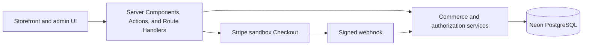

# Maison Vale portfolio case study

## Project summary

Maison Vale is a fictional premium fashion and lifestyle retailer built to demonstrate full-stack commerce engineering. The project combines an editorial storefront with server-authoritative checkout, webhook-driven payment truth, transactional inventory, privacy-aware guest order access, controlled administration, and evidence-based deployment.

The application is publicly available as a Stripe sandbox at [maison-vale-six.vercel.app](https://maison-vale-six.vercel.app). It is a portfolio system, not a live retailer, and no revenue, customer, conversion, or commercial-impact claims are made.

## Business problem

A polished shop is easy to imitate visually but harder to make trustworthy. Prices can become stale, stock can change during payment, webhooks can be delivered more than once, public order references can leak information, and administrative screens can accidentally depend on client-side permission checks.

Maison Vale was designed around a stricter question: how should a small commerce application remain truthful when the browser, external payment provider, and database do not update at the same time?

## Solution

The storefront supports catalogue browsing, product variants, a persistent guest cart, checkout, payment confirmation, and guest order lookup. The browser stores only minimal cart identifiers. Every server boundary re-reads current catalogue visibility, price, and inventory before calculating totals or accepting a checkout.

The administrative workspace supports catalogue and inventory operations, order fulfillment, and analytics. Active ADMIN and STAFF users are revalidated against PostgreSQL on protected requests. Read access is explicitly shared where appropriate; catalogue, inventory, and fulfillment mutations independently require ADMIN authority.

## Key functionality

- Eight fictional products in four collections with variant-aware galleries and stock states
- Server-resolved cart and checkout totals using integer cents
- Stripe-hosted card checkout in test mode
- Signed, idempotent webhook processing with atomic inventory finalization
- Guest lookup with generic denial responses, rate limits, a scoped HttpOnly session, and masked public details
- Transactional stock adjustments and immutable inventory movements
- Searchable catalogue and order administration with role boundaries
- Read-only analytics based on persisted payment, refund, order-item, and stock records
- Vercel deployment with a Neon pooled runtime connection and guarded operational scripts

## Architecture

The interface handles presentation and interaction. Server boundaries normalize hostile input and return allow-listed data. Domain services own payment, inventory, fulfillment, lookup, and authorization rules. Prisma and PostgreSQL provide constraints, conditional updates, idempotency records, and transactions.

## Payment and inventory lifecycle

Checkout stores a pending order, item snapshots, and payment before redirecting to Stripe. The return URL is not payment proof. A signed `checkout.session.completed` webhook must match the stored session, internal order linkage, amount, currency, and sandbox mode.

Successful finalization claims the payment transition and, in one transaction, decrements all purchased variants, records movement history, advances the order from pending to processing, and records the webhook outcome. Duplicate and concurrent events cannot repeat those effects.

The design deliberately avoids inventory reservation. If payment succeeds after stock becomes unavailable, inventory work rolls back, payment remains recorded as paid, and the order enters a manual-review exception instead of presenting a false failure or partially decrementing stock.

## Privacy and security model

Guest order numbers are identifiers, not credentials. Lookup requires the matching checkout email and consumes proof-pair and source-wide rate limits. Successful verification creates a signed 15-minute HttpOnly cookie limited to `/orders` and one internal order. Public DTOs omit email, street address, SKUs, database identifiers, Stripe identifiers, diagnostic metadata, and internal notes.

Administrative authentication uses Auth.js credentials sessions with an eight-hour lifetime. Protected requests recheck that the database user still exists and is active. Role authorization is enforced on the server operation rather than inferred from whether a control is visible in the browser.

Additional safeguards include canonical Origin checks, byte-bounded bodies, conservative logs, production security headers, private/no-store responses, trusted Vercel proxy handling, TLS requirements, and explicit gates around high-risk operational scripts.

## Engineering challenges

### Preserving payment truth

The central challenge was separating navigation from financial truth. A successful browser redirect says only that the customer returned. Payment changes are accepted only through a verified provider event linked to the stored order.

### Making retries harmless

Checkout attempts and webhook events can be retried. Stable idempotency keys, database uniqueness, independent event and payment claims, conditional status changes, and transaction boundaries make repeats safe without fabricating success.

### Balancing guest access and privacy

Email plus reference offers useful guest access without customer accounts, but it is intentionally described as lightweight verification. Short expiry, one-order scope, generic failures, rate limits, constant-time proof comparison, and masked output reduce exposure. Stronger emailed one-time verification remains future infrastructure.

### Deploying safely

The hosted application uses Neon's pooled endpoint at runtime while controlled migrations use a separate direct connection. Builds never migrate or seed. Remote catalogue bootstrap, reconciliation, and administrator provisioning each require explicit purpose-specific gates.

## Demonstrated results

Read-only hosted QA verified the public storefront and catalogue routes, all 25 optimized images, security headers, indexing/cache boundaries, unauthenticated admin protection, and missing-Origin rejection on the Vercel deployment.

One real Stripe sandbox checkout was completed. The reviewed persisted state showed:

- Payment status `PAID`
- Order status `PROCESSING`
- Webhook outcome `PAYMENT_FINALIZED`
- One inventory movement of `-2`
- No payment exception

These results demonstrate the intended technical lifecycle for one fictional sandbox order. They are not evidence of production scale, business performance, or live-payment readiness.

## Verification approach

The project uses focused Vitest coverage, PostgreSQL integration scripts, type checking, linting, production builds, asset verification, configuration checks, and a read-only hosted smoke script. Tested scenarios include stale carts, stock races, payment duplication, mismatched provider data, transaction rollback, guest lookup isolation, role boundaries, and administrative workflows.

The owner reports completing the agreed browser checklist on 9 October 2026, covering desktop storefront/product navigation, mobile responsiveness, basic keyboard navigation and visible focus, browser zoom and motion preferences, the authenticated administrator workflow, and guest order lookup behavior. This report is distinct from automated testing and the independently reviewed database/payment outcome; no formal accessibility audit, screen-reader result, detailed measurement, screenshot, or additional artifact is claimed. Hosted STAFF/inactive-user verification, production cookie inspection, advanced lookup and webhook edge cases, formal accessibility verification, provider logs, monitoring, backups, and rollback remain pending.

## Current limitations

- Stripe sandbox only; live keys and live events are rejected.
- USD and U.S.-only checkout with fixed shipping and no automated tax calculation.
- No automated refund, cancellation/restock, carrier, or tracking workflow.
- No customer accounts, administrator MFA, password recovery, or transactional email verification.
- Fulfillment transitions are manual operational records, not carrier-confirmed events.
- Monitoring, backup restoration, rollback drills, and final screenshot evidence remain outstanding.
- No penetration test or compliance certification has been performed.

## Portfolio relevance

Maison Vale demonstrates work across product presentation, server-side application design, relational data modeling, payment integration, authorization, privacy, testing, and deployment operations. The strongest evidence is not a fabricated sales figure; it is the traceable relationship between documented rules, automated checks, hosted behavior, and persisted sandbox outcomes.
